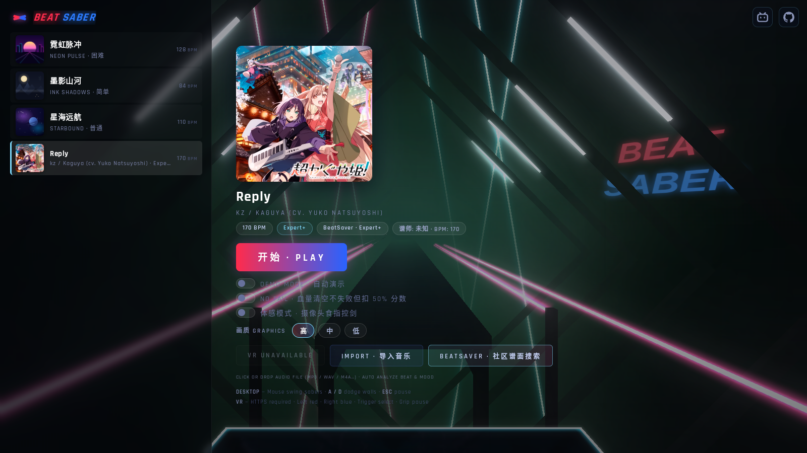
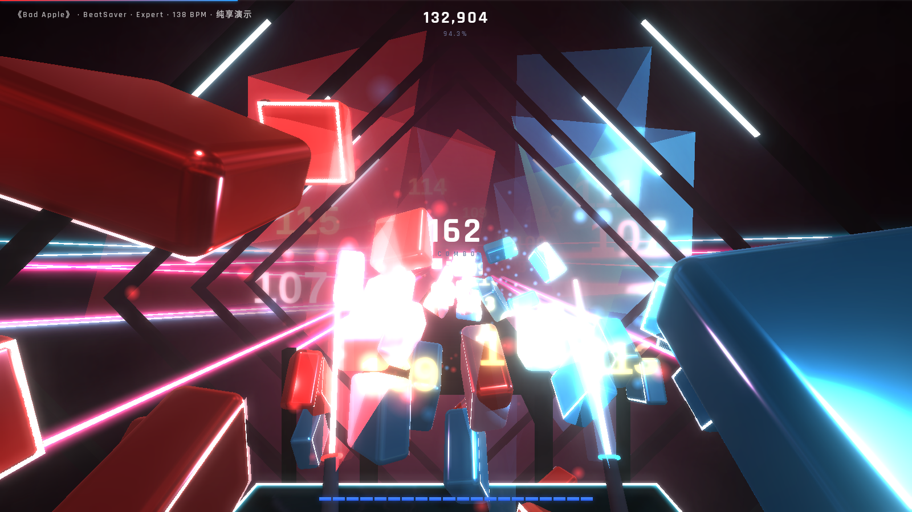
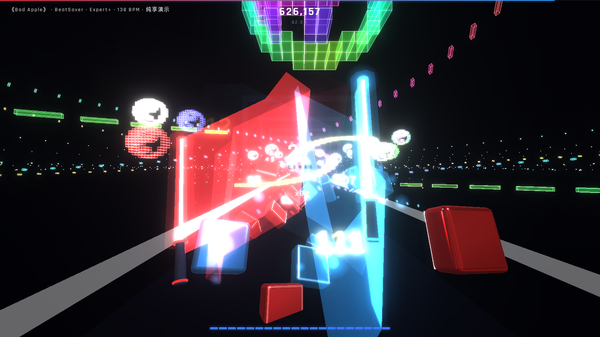
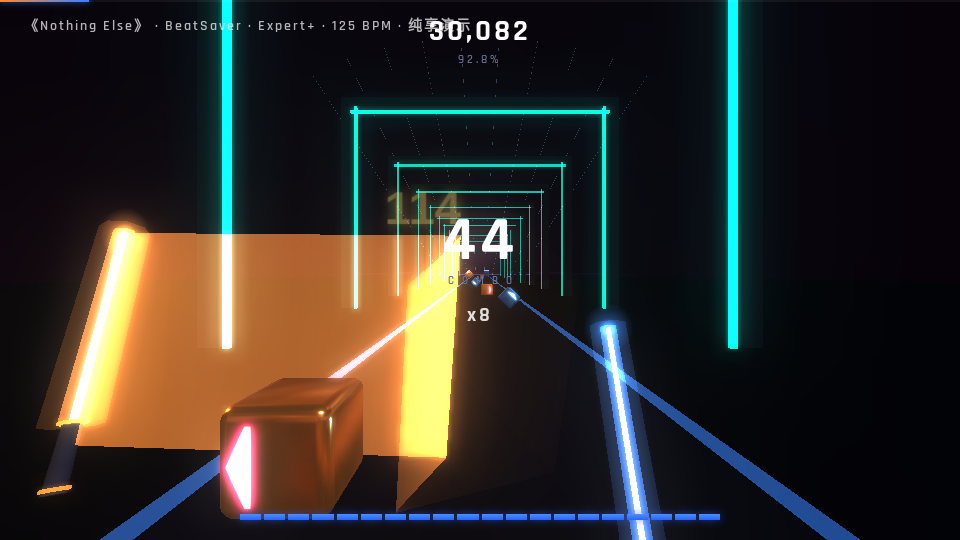
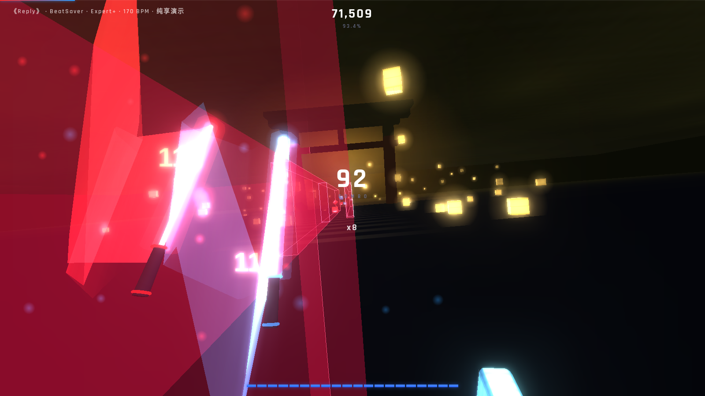

# Beat Saber WebXR

网页版节奏光剑。桌面鼠标、摄像头体感、WebXR VR 三种玩法,深度兼容 BeatSaver 社区 20 万+ 谱面(Chroma / Noodle Extensions / 观赏谱 / modchart),舞台与方块按官方观感还原。

**在线体验:https://beatsaber.xixiu.top**
(VR 需 HTTPS,已配好)

## 截图

| 主页(官方舞台背景 + 霓虹灯牌) | 官方舞台 · 灯光事件驱动 |
|---|---|
|  |  |

| 观赏谱 Bad Apple(12.4 万面墙全量渲染) | modchart 镜头飞行(Nothing Else) |
|---|---|
|  |  |

| 神社主题(Reply · 鸟居/灯笼海/灯笼方块) |
|---|
|  |

> VR 实机截图待补充。

## 定位与同类项目

网页端已有成熟的可玩节奏光剑类实现——最具代表性的是 [Moon Rider](https://moonrider.xyz/)(Supermedium 出品,Classic 模式即挥剑切块,接入 BeatSaver 曲库,长期稳定运营)。本项目并非首个网页可玩实现,定位差异在于:

- **以复刻官方观感为目标**:官方舞台模型与着色器、官方方块模型/箭头/材质配方、整块方向旋转、灯光事件全通道对位——而非风格化重设计
- **社区谱高级生态**:据我们检索,本项目是目前网页端已知唯一同时支持 **Chroma**(逐物件/逐事件颜色、官方 colorSchemes)、**Noodle Extensions**(关键帧动画、溶解、幽灵音符、旋转墙)、**modchart**(AssignPlayerToTrack 镜头飞行、轨道父子链)与**观赏谱全量墙体渲染**的实现;此前这套 MOD 生态仅存在于 PC/Quest 原生模组中
- 此外提供摄像头手部体感玩法、BeatLeader 榜单源与中文界面

> 上述"唯一"表述基于 2026-07 的公开检索,如有遗漏欢迎指正。

## 特性总览

### 三种玩法
- **桌面**:鼠标双剑(右手跟随、左手镜像),A/D 侧倾躲墙,ESC 暂停
- **摄像头体感**:MediaPipe 手部追踪,左右手食指各控一把剑(模型/wasm 自托管 + 对象存储分发,浏览器本地推理,600ms 无手自动回落鼠标)
- **WebXR VR**:双手柄 6DoF 光剑、按官方分级的手柄震动(正切/错切/炸弹)、桌面同款双面板选歌界面(摇杆滚动 + 激光逐像素点选)、VR 内搜索/下载/QWERTY 键盘、画质/帧率(30/60/90/无限)/原画墙就地设置

### 谱面兼容
- **格式**:v2 / v3 谱面,多难度解析与切换(Info.dat 权威映射),滑条(arcs)、链条(chains)、炸弹、墙体
- **Chroma**:逐事件/逐物件自定义颜色、SongCore customColors、官方 Info.dat v2.1 colorSchemes(方块与灯光分别取色)
- **Noodle Extensions**(深度子集):pointDefinitions 关键帧库、AnimateTrack、AssignPathAnimation、逐物件 `_animation`、18 种缓动、`_dissolve` 溶解、`_interactable` 幽灵音符、`_definitePosition` 绝对路径、精确坐标音符/墙体、静态 `_rotation`/`_localRotation` 旋转墙、**AssignTrackParent 轨道父子链**、**AssignPlayerToTrack 镜头飞行**(桌面端,光剑视觉随镜头)
- **观赏谱(wall-art)**:墙体全量渲染按画质分档(桌面高画质不限量;VR 低 2000/中 6000/高 2 万 + "原画墙"开关解除限制),共享几何体优化高频刷墙

> 逐字段的完整格式支持明细(含包结构 / v2 / v3 / 配色优先级)见 **[docs/format-support.md](docs/format-support.md)**。

### 官方观感还原(参考 [beatsaver-viewer](https://github.com/supermedium/beatsaver-viewer),MIT)
- **舞台 1:1 移植**:官方跑道双模型 + atlas 遮罩着色器(UV 分区染色/假径向雾)、3+3 旋转侧激光、烟雾环、法线贴图反光地板;灯光事件全通道对位(背景辉光/隧道霓虹/左右激光/地板/激光转速),on/flash/fade 三态动画,无灯光数据的谱有节拍兜底灯光秀
- **方块**:官方 beat.obj 倒角模型 + atlas 箭头/圆点精灵 + 录音棚环境反射,官方材质配方;**切割方向 = 整块旋转**(斜向呈菱形姿态);切割为官方式两半分离 + 白热切面
- **音效**:游戏提取的打击音效组(随机变体)+ UI 悬停/点击音
- **环境**:11 种 `_environmentName` 舞台变体;神社主题环境(Reply:鸟居、海上灯笼、灯笼皮肤方块)

### 内容获取
- **BeatSaver**:关键词搜索(相关性排序)、4-6 位 ID 直接下载、11 个分类标签 × 热门/最新浏览、一键下载 TOP10(自动翻批)
- **BeatLeader**:榜单热度(按真实游玩次数)、排位谱(按星级),经同源反代接入
- **本地导入**:拖入音频文件自动分析生成谱面
- 谱面持久化到浏览器 IndexedDB(含封面、全部难度),刷新不丢;下载有分段进度(解析/下载 %/入库)

### 性能
- 画质三档:高(全分辨率 bloom)/ 中(半分辨率 bloom)/ 低(关闭后处理)
- **像素预算自适应**:按窗口面积 × dpr 钳制总渲染像素(大屏 Retina 自动降 pixelRatio,小窗保持 2× 锐利)
- VR:帧缓冲随画质缩放 + 最大注视点渲染 + 原生/软双层帧率限制
- 自动演示(DEMO)带拟人挥剑编排(蓄力-挥砍-收剑),保证全切;NO FAIL 模式血量清空不失败(扣 50% 总分)

## 操作速查

### 桌面
| 操作 | 方式 |
|------|------|
| 挥砍光剑 | 鼠标移动(右手实、左手镜像) |
| 躲避墙壁 | A / D |
| 暂停 | ESC |
| 体感模式 | 菜单开关"体感模式",举起双手食指 |

### VR
| 操作 | 按钮 |
|------|------|
| 选歌/面板 | 激光指向 + 扳机;摇杆上下滚动列表 |
| 暂停 | 左手菜单键 |
| 暂停-继续 / 重开 | 左手扳机 / 右手扳机 |
| 结算-重试 / 回菜单 | 左手扳机 / 右手扳机 |

## 内置歌曲

| 歌曲 | BPM | 风格 |
|------|-----|------|
| 霓虹脉冲 NEON PULSE | 128 | EDM |
| 墨影山河 INK SHADOWS | 84 | 国风古筝 |
| 星海远航 STARBOUND | 110 | Synthwave |
| Reply(内置社区谱) | 170 | 神社主题 · Expert+ |

## 已知缺口与规划

| 事项 | 说明 | 状态 |
|---|---|---|
| v4 谱面格式 | 1.34+ 索引化新格式,新谱占比在涨,当前解析不完整 | 规划中 |
| BPM 变更 | v2 `_BPMChanges` / v3 `bpmEvents`,变速谱时间轴会漂移 | 规划中 |
| 90°/360° 旋转谱 | `rotationEvents` 未实现 | 待评估 |
| v3 命名的 Noodle 字段 | `coordinates`/`track`/`animation`(现存 modchart 绝大多数为 v2) | 低优先 |
| Vivify(Unity 资产包) | 网页原理性无法加载,以主题环境近似(如 Reply 神社) | 无解 |
| VR 实机截图 | Quest 实拍 | 待补充 |

## 本地开发

```bash
npm install
npm run dev      # 开发服务器(HTTPS)
npm run build    # 产物在 dist/
```

技术栈:Vue 3 + TypeScript + Three.js(WebXR)+ Web Audio + IndexedDB + MediaPipe Tasks Vision。

## 致谢与声明

- 舞台模型/着色器/方块模型/箭头精灵移植自 [supermedium/beatsaver-viewer](https://github.com/supermedium/beatsaver-viewer)(MIT)
- 手部追踪:[MediaPipe](https://github.com/google-ai-edge/mediapipe) HandLandmarker
- 谱面数据:[BeatSaver](https://beatsaver.com) / [BeatLeader](https://beatleader.xyz) 公开 API
- 本项目为非商业粉丝作品,与 Beat Games / Meta 无关;"Beat Saber" 商标归其所有者
